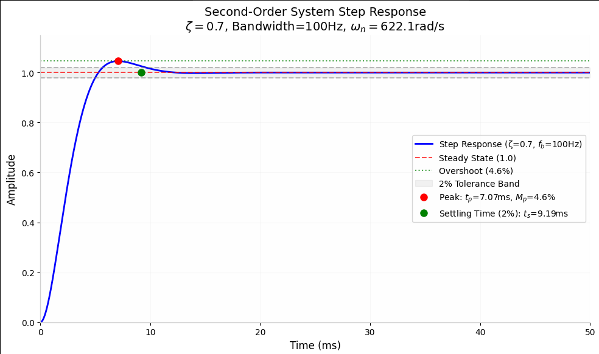
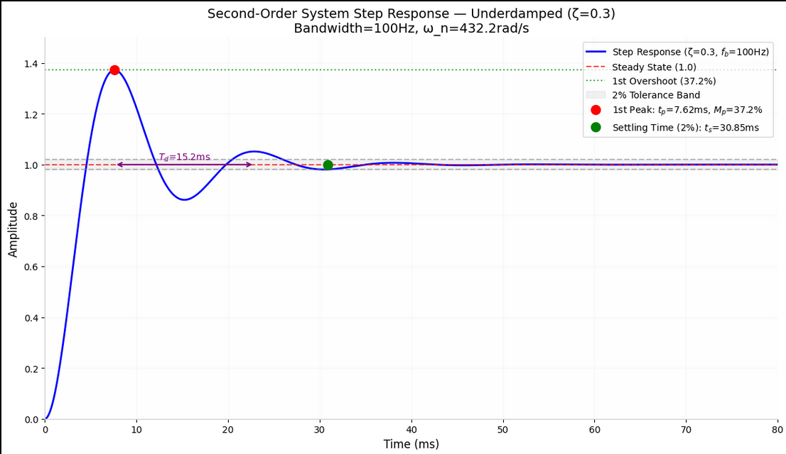

# 二阶系统

### 串联RLC微分方程

串联RLC电路的微分方程根据基尔霍夫电压定律（KVL）推导：

$$V(t) = V_R + V_L + V_C = i(t)R + L\frac{di(t)}{dt} + \frac{1}{C}\int_0^t i(\tau)d\tau$$

其中：
- $V(t)$：电源电压
- $i(t)$：回路电流
- $R$：电阻值
- $L$：电感值
- $C$：电容值

为了得到标准的二阶微分方程，对上述方程两边关于时间 $t$ 求导：

$$L\frac{d^2i(t)}{dt^2} + R\frac{di(t)}{dt} + \frac{1}{C}i(t) = \frac{dV(t)}{dt}$$

或者用电荷 $q(t)$ 表示（$i(t) = dq/dt$）：

$$L\frac{d^2q(t)}{dt^2} + R\frac{dq(t)}{dt} + \frac{1}{C}q(t) = V(t)$$

这是二阶线性常系数微分方程的标准形式。

### 拉普拉斯变换

#### 以电荷 $q(t)$ 为输出的传递函数

对微分方程 $L\frac{d^2q(t)}{dt^2} + R\frac{dq(t)}{dt} + \frac{1}{C}q(t) = V(t)$ 进行拉普拉斯变换（零初始条件）：

$$L[s^2Q(s)] + R[sQ(s)] + \frac{1}{C}Q(s) = V(s)$$

整理得传递函数：

$$G_q(s) = \frac{Q(s)}{V(s)} = \frac{1}{Ls^2 + Rs + \frac{1}{C}}$$

#### 归一化与标准形式

将传递函数分子分母同时除以 $L$：

$$G_q(s) = \frac{1/L}{s^2 + \frac{R}{L}s + \frac{1}{LC}}$$

定义：
- 自然频率（无阻尼振荡频率）：$\omega_n = \frac{1}{\sqrt{LC}}$
- 阻尼比：$\zeta = \frac{R}{2}\sqrt{\frac{C}{L}} = \frac{R}{2}\cdot\frac{\sqrt{C}}{\sqrt{L}}$

**注意**：$
2\zeta\omega_n = 2 \cdot \frac{R}{2}\sqrt{\frac{C}{L}} \cdot \frac{1}{\sqrt{LC}} = \frac{R}{L}
$

因此传递函数可写为：

$$G_q(s) = \frac{1/L}{s^2 + 2\zeta\omega_n s + \omega_n^2}$$

这是**带增益的二阶低通系统**，增益为 $K = 1/L$。

#### 以电流 $i(t)$ 为输出的传递函数

实际工程中常以电流为输出，$i(t) = \frac{dq}{dt}$，因此：

$$I(s) = sQ(s)$$

$$G_i(s) = \frac{I(s)}{V(s)} = s \cdot \frac{Q(s)}{V(s)} = \frac{s}{Ls^2 + Rs + \frac{1}{C}} = \frac{s/L}{s^2 + 2\zeta\omega_n s + \omega_n^2}$$

这是**带零点的二阶系统**（零点在原点 $s=0$）。

#### 以电容电压 $v_C(t)$ 为输出的传递函数

电容电压 $v_C(t) = \frac{1}{C}q(t)$，因此：

$$V_C(s) = \frac{1}{C}Q(s)$$

$$G_{v_C}(s) = \frac{V_C(s)}{V(s)} = \frac{1}{C} \cdot \frac{Q(s)}{V(s)} = \frac{1/C}{Ls^2 + Rs + \frac{1}{C}} = \frac{\frac{1}{LC}}{s^2 + 2\zeta\omega_n s + \omega_n^2} = \frac{\omega_n^2}{s^2 + 2\zeta\omega_n s + \omega_n^2}$$

这是**标准的二阶低通系统**，单位直流增益。

#### 统一的形式

三种输出的传递函数可统一表示为：

1. **电荷 $q(t)$**：$G_q(s) = \frac{1/L}{s^2 + 2\zeta\omega_n s + \omega_n^2}$
2. **电流 $i(t)$**：$G_i(s) = \frac{s/L}{s^2 + 2\zeta\omega_n s + \omega_n^2}$（带零点）
3. **电容电压 $v_C(t)$**：$G_{v_C}(s) = \frac{\omega_n^2}{s^2 + 2\zeta\omega_n s + \omega_n^2}$（标准二阶低通）

#### 极点和特征方程

三种情况具有相同的特征方程和极点：

$$s^2 + 2\zeta\omega_n s + \omega_n^2 = 0$$

极点位置：

$$s_{1,2} = -\zeta\omega_n \pm \omega_n\sqrt{\zeta^2 - 1}$$

根据阻尼比 $\zeta$ 的不同，系统响应分为：
1. **欠阻尼**（$0 < \zeta < 1$）：共轭复数极点，振荡响应

2. **临界阻尼**（$\zeta = 1$）：重实极点，最快无超调响应

3. **过阻尼**（$\zeta > 1$）：两个不同实极点，无超调慢响应

4. **无阻尼**（$\zeta = 0$）：纯虚数极点，持续振荡
        
        

### 带宽的定义及和固有频率的关系，给出详细的推导过程

#### 带宽的定义

对于线性时不变系统，带宽 $\omega_b$（角频率）定义为频率响应幅值下降到直流增益的 $1/\sqrt{2}$（即 -3dB）时的频率。以Hz为单位的带宽 $f_b = \omega_b/(2\pi)$。

对于标准二阶低通系统（电容电压输出）：

$$G_{v_C}(s) = \frac{V_C(s)}{V(s)} = \frac{\omega_n^2}{s^2 + 2\zeta\omega_n s + \omega_n^2}$$

其直流增益为 $|G_{v_C}(j0)| = 1$。

#### 频域分析

令 $s = j\omega$，代入传递函数：

$$G_{v_C}(j\omega) = \frac{\omega_n^2}{\omega_n^2 - \omega^2 + j2\zeta\omega_n\omega}$$

幅频特性：

$$|G_{v_C}(j\omega)| = \frac{\omega_n^2}{\sqrt{(\omega_n^2 - \omega^2)^2 + (2\zeta\omega_n\omega)^2}}$$

#### 带宽方程建立

根据带宽定义，当 $\omega = \omega_b$ 时：

$$|G_{v_C}(j\omega_b)| = \frac{1}{\sqrt{2}}$$

代入幅频特性表达式：

$$\frac{\omega_n^2}{\sqrt{(\omega_n^2 - \omega_b^2)^2 + (2\zeta\omega_n\omega_b)^2}} = \frac{1}{\sqrt{2}}$$

#### 求解带宽

1. 两边取倒数：
   $$\frac{\sqrt{(\omega_n^2 - \omega_b^2)^2 + (2\zeta\omega_n\omega_b)^2}}{\omega_n^2} = \sqrt{2}$$

2. 两边平方：
   $$\frac{(\omega_n^2 - \omega_b^2)^2 + (2\zeta\omega_n\omega_b)^2}{\omega_n^4} = 2$$

3. 两边乘以 $\omega_n^4$：
   $$(\omega_n^2 - \omega_b^2)^2 + (2\zeta\omega_n\omega_b)^2 = 2\omega_n^4$$

4. 展开：
   $$\omega_n^4 - 2\omega_n^2\omega_b^2 + \omega_b^4 + 4\zeta^2\omega_n^2\omega_b^2 = 2\omega_n^4$$

5. 整理：
   $$\omega_b^4 + 2\omega_n^2\omega_b^2(2\zeta^2 - 1) - \omega_n^4 = 0$$

6. 令 $x = \omega_b^2$，得到关于 $x$ 的二次方程：
   $$x^2 + 2\omega_n^2(2\zeta^2 - 1)x - \omega_n^4 = 0$$

7. 求解二次方程：
   $$x = \omega_n^2\left[-(2\zeta^2 - 1) \pm \sqrt{(2\zeta^2 - 1)^2 + 1}\right]$$

   由于 $\omega_b^2 > 0$，取正号：
   $$\omega_b^2 = \omega_n^2\left[\sqrt{(2\zeta^2 - 1)^2 + 1} - (2\zeta^2 - 1)\right]$$

#### 最终带宽公式

$$\omega_b = \omega_n \sqrt{\sqrt{(2\zeta^2 - 1)^2 + 1} - (2\zeta^2 - 1)}$$

或等价地：

$$\omega_b = \omega_n \sqrt{1 - 2\zeta^2 + \sqrt{4\zeta^4 - 4\zeta^2 + 2}}$$

#### 特殊情况的简化

1. **临界阻尼情况**（$\zeta = 1$）：
   $$\omega_b = \omega_n \sqrt{\sqrt{(2 - 1)^2 + 1} - (2 - 1)} = \omega_n \sqrt{\sqrt{1 + 1} - 1} = \omega_n \sqrt{\sqrt{2} - 1} \approx 0.6436\omega_n$$

2. **最佳阻尼情况**（$\zeta = 1/\sqrt{2} \approx 0.707$）：
   $$\omega_b = \omega_n \sqrt{\sqrt{(1 - 1)^2 + 1} - (1 - 1)} = \omega_n \sqrt{\sqrt{0 + 1} - 0} = \omega_n$$

   此时带宽等于自然频率，这也是巴特沃斯滤波器的特性。

3. **欠阻尼情况**（$\zeta < 0.707$）：带宽 $\omega_b > \omega_n$

4. **过阻尼情况**（$\zeta > 0.707$）：带宽 $\omega_b < \omega_n$

#### 近似公式

对于 $0.5 < \zeta < 1.0$ 的范围，可使用近似公式：

$$\omega_b \approx \omega_n \sqrt{1 - 2\zeta^2 + \sqrt{2 - 4\zeta^2 + 4\zeta^4}}$$

或更简化的经验公式：

$$\omega_b \approx \omega_n (1.55 - 0.55\zeta) \quad (0.5 < \zeta < 1.0)$$

#### 表格：不同阻尼比下的带宽比

| 阻尼比 $\zeta$ | 带宽比 $\omega_b/\omega_n$ | 近似值 |
|----------------|----------------------------|--------|
| 0.1 | 1.554 | 1.5445 |
| 0.2 | 1.512 | 1.5390 |
| 0.3 | 1.430 | 1.5335 |
| 0.4 | 1.310 | 1.5280 |
| 0.5 | 1.163 | 1.5225 |
| 0.6 | 1.000 | 1.5170 |
| **0.707** | **1.000** | **1.5106** |
| 0.8 | 0.936 | 1.5060 |
| 0.9 | 0.846 | 1.5015 |
| 1.0 | 0.644 | 1.4970 |
| 1.2 | 0.412 | 1.4880 |
| 1.5 | 0.233 | 1.4725 |

#### 总结公式

- 自然频率：$\omega_n = \frac{1}{\sqrt{LC}}$
- 阻尼比：$\zeta = \frac{R}{2}\sqrt{\frac{C}{L}}$
- 带宽（精确）：$\omega_b = \omega_n \sqrt{\sqrt{(2\zeta^2 - 1)^2 + 1} - (2\zeta^2 - 1)}$
- 带宽（近似，$\zeta \approx 0.707$）：$\omega_b \approx \omega_n$
- 带宽（Hz）：$f_b = \frac{\omega_b}{2\pi} = \frac{\omega_n}{2\pi} \sqrt{\sqrt{(2\zeta^2 - 1)^2 + 1} - (2\zeta^2 - 1)}$
